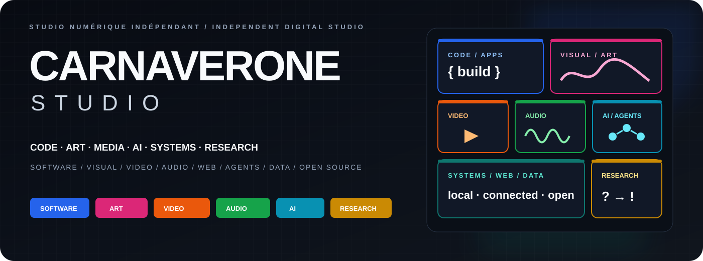
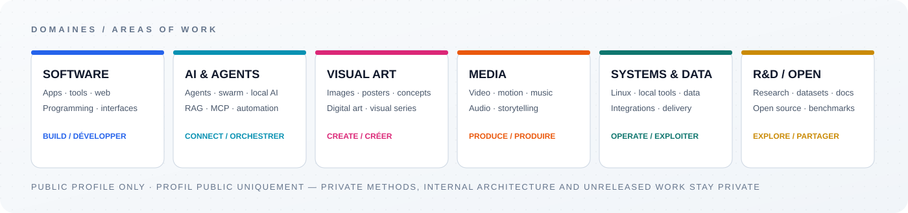

  

  

  <strong>BUILD · CODE · SYSTEMS</strong>

  
  
  
  
  

  <strong>AI · AGENTS · AUTOMATION</strong>

  
  
  
  
  
  
  

  <strong>CREATIVE · MEDIA · DATA · RESEARCH</strong>

  
  
  
  
  
  
  
  

  <a href="https://carnaverone.com"><strong>Website / Site</strong></a>
  &nbsp;·&nbsp;
  <a href="https://github.com/carnaverone?tab=repositories"><strong>Repositories / Dépôts</strong></a>
  &nbsp;·&nbsp;
  <a href="mailto:contact@carnaverone.com"><strong>Contact</strong></a>

---

## About us / Qui nous sommes

<table>
<tr>
<td width="50%" valign="top">
<strong>One studio, several mediums.</strong> 
Carnaverone Studio builds projects where software, AI, systems, research and creative media can meet in the same workspace.
</td>
<td width="50%" valign="top">
<strong>Un studio, plusieurs médiums.</strong> 
Carnaverone Studio développe des projets où logiciel, IA, systèmes, recherche et création multimédia peuvent se rencontrer dans un même espace de travail.
</td>
</tr>
<tr>
<td width="50%" valign="top">
<strong>From utility to experiment.</strong> 
One project may be a Linux tool or web application; the next may be an AI-agent prototype, a voice interface, a visual series, an avatar experience or a public dataset.
</td>
<td width="50%" valign="top">
<strong>De l’utilitaire à l’expérimentation.</strong> 
Un projet peut être un outil Linux ou une application web; le suivant peut devenir un prototype d’agents IA, une interface vocale, une série visuelle, une expérience avec avatar ou un dataset public.
</td>
</tr>
<tr>
<td width="50%" valign="top">
<strong>Built to become concrete.</strong> 
The work moves from research and prototypes toward usable tools, public releases, reusable components and documented experiments rather than staying at the idea stage.
</td>
<td width="50%" valign="top">
<strong>Conçu pour devenir concret.</strong> 
Le travail passe de la recherche et du prototype vers des outils utilisables, des publications publiques, des composants réutilisables et des expérimentations documentées plutôt que de rester au stade de l’idée.
</td>
</tr>
</table>

---

## What we do / Ce que nous faisons

<table>
<tr>
<td width="50%" valign="top">
<strong>💻 Build software that does a job</strong> 
Desktop and web applications, creator tools, utilities, technical interfaces, integrations and local-first software — with Linux and real-world use in mind.  
Apps · tools · web · desktop · Linux · integrations · packaging
</td>
<td width="50%" valign="top">
<strong>💻 Construire des logiciels qui servent vraiment</strong> 
Applications desktop et web, outils pour créateurs, utilitaires, interfaces techniques, intégrations et logiciels local-first — avec Linux et l’usage réel en tête.  
Applications · outils · web · desktop · Linux · intégrations · packaging
</td>
</tr>
<tr>
<td width="50%" valign="top">
<strong>🤖 Turn AI into working systems</strong> 
Agents, multi-agent and swarm experiments, local inference, RAG, MCP and automation are explored as parts of usable systems — alongside voice, multimodal interfaces and avatars.  
Agents · swarm · local AI · RAG · MCP · ASR/TTS · multimodal
</td>
<td width="50%" valign="top">
<strong>🤖 Transformer l’IA en systèmes fonctionnels</strong> 
Agents, expérimentations multi-agents et swarm, inférence locale, RAG, MCP et automatisation sont explorés comme parties de systèmes utilisables — avec la voix, le multimodal et les avatars.  
Agents · swarm · IA locale · RAG · MCP · ASR/TTS · multimodal
</td>
</tr>
<tr>
<td width="50%" valign="top">
<strong>🎨 Create beyond the interface</strong> 
Images, posters, video, motion, music, audio, narration and visual experiments can be standalone work or become part of applications, interfaces and interactive media.  
Digital art · image · video · motion · music · audio · narration
</td>
<td width="50%" valign="top">
<strong>🎨 Créer au-delà de l’interface</strong> 
Images, affiches, vidéo, motion, musique, audio, narration et expérimentations visuelles peuvent exister seules ou devenir une partie d’applications, d’interfaces et de médias interactifs.  
Art numérique · image · vidéo · motion · musique · audio · narration
</td>
</tr>
<tr>
<td width="50%" valign="top">
<strong>🔬 Research with an output</strong> 
Research is used to compare, test and document ideas, then turn the useful parts into datasets, benchmarks, prototypes, documentation or open-source building blocks.  
Research · datasets · benchmarks · documentation · prototypes · open source
</td>
<td width="50%" valign="top">
<strong>🔬 Faire de la recherche avec un résultat concret</strong> 
La recherche sert à comparer, tester et documenter des idées, puis à transformer ce qui est utile en datasets, benchmarks, prototypes, documentation ou briques open source.  
Recherche · datasets · benchmarks · documentation · prototypes · open source
</td>
</tr>
</table>

---

## Capabilities / Compétences

<strong>💻 Code & development / Code & développement</strong>

 

  
  
  
  
  
  
  
  
  
  

<strong>🤖 AI, agents & automation / IA, agents & automatisation</strong>

 

  
  
  
  
  
  
  
  
  
  

<strong>🖥️ Systems, data & delivery / Systèmes, données & livraison</strong>

 

  
  
  
  
  
  
  
  

<strong>🎬 Creative & media / Créatif & médias</strong>

 

  
  
  
  
  
  
  

---

## Public work / Travail public

<table>
<tr>
<td width="50%" valign="top">
<strong>🐙 GitHub = public technical work</strong> 
Apps, developer tools, reusable utilities, open datasets, documentation, prototypes and selected research. Some repositories are finished releases; others are active public experiments.  
<a href="https://github.com/carnaverone?tab=repositories"><strong>Browse repositories →</strong></a>
</td>
<td width="50%" valign="top">
<strong>🐙 GitHub = travail technique public</strong> 
Applications, outils de développement, utilitaires réutilisables, datasets ouverts, documentation, prototypes et recherche sélectionnée. Certains dépôts sont finalisés; d’autres restent des expérimentations publiques actives.  
<a href="https://github.com/carnaverone?tab=repositories"><strong>Voir les dépôts →</strong></a>
</td>
</tr>
<tr>
<td width="50%" valign="top">
<strong>🌐 Carnaverone.com = the wider studio</strong> 
Visual work, media, publications, digital projects and selected releases that go beyond source code.  
<a href="https://carnaverone.com"><strong>Visit the studio →</strong></a>
</td>
<td width="50%" valign="top">
<strong>🌐 Carnaverone.com = le studio au sens large</strong> 
Travail visuel, médias, publications, projets numériques et réalisations sélectionnées qui dépassent le code source.  
<a href="https://carnaverone.com"><strong>Visiter le studio →</strong></a>
</td>
</tr>
</table>

<table>
<tr>
<td width="50%" valign="top">
Public profile only — internal architecture, private research, unreleased concepts and private production details stay outside this page.
</td>
<td width="50%" valign="top">
Profil public seulement — les architectures internes, recherches privées, concepts non publiés et détails de production privés restent hors de cette page.
</td>
</tr>
</table>

---

  <a href="mailto:contact@carnaverone.com">contact@carnaverone.com</a>
  &nbsp;·&nbsp;
  <a href="https://carnaverone.com">carnaverone.com</a>

